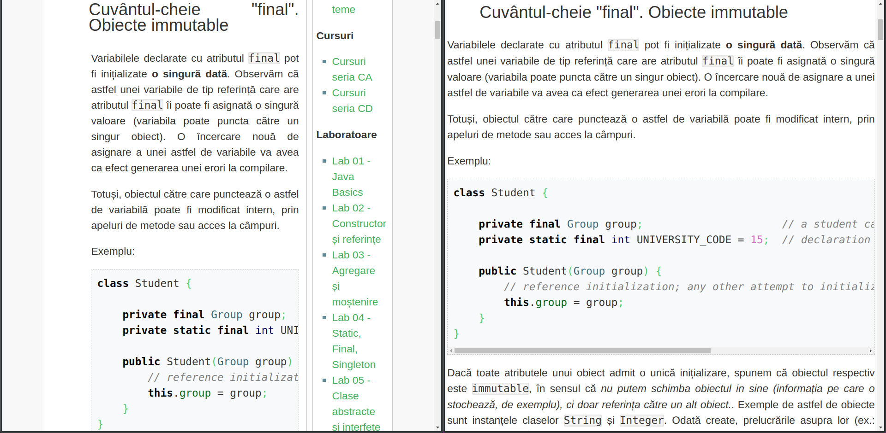

# OCWCandy
A simple chrome extension for UPB students who want two windows side by side while not wasting precious space.

Left - The default window  |  Right - with OCW Candy toggled On

Installation
============
You will need to turn developer mode on in __`chrome://extensions`__ from top right.

1. Clone OCW Candy to our system;
2. Select the cloned repo in __`chrome://extensions`__ in Load unpacked, top left button;
3. Pin OCW Candy;
4. Right click on OCW Candy, if second line is __`Can't read or change site's data`__, then go to [OCW](https://ocw.cs.pub.ro/courses/), right click again on the second line button and select __`When you click extension`__;

How to use
==========
Go to OCW, to the Laboratory/Homework page, select your particular lab, after the page loads, toggle OCW Candy from the On button, and to stop, toggle from Off.

Original Developer
------------------

 * Pavel-Vlad Mateescu - [Pvl26](https://github.com/Pvl26)
